## Introduction

We are currently living in the **"Demo Era"** of AI agents.

Scroll through X (Twitter) or verify the latest product launches, and you will see "frontier agents" performing miracles. They book flights, write code, and negotiate emails. But anyone who has pulled back the curtain and tried to integrate these agents into a production environment knows the uncomfortable truth: **They are impressive, but they are incredibly fragile.**

Right now, an autonomous agent is like a toddler with a PhD. It is brilliant and capable of immense feats, but if you take your eyes off it for five minutes, it will likely burn the house down.

Most engineers are solving this by building better guardrails or hiring humans to "babysit" the AI. I am taking a different approach. I believe the path to **massive autonomy (10,000+ steps)** isn't about better prompting—it's about solving the physics of **compounding errors**.

## Body

### The Mathematics of "The Drift"

Why do agents fail over long horizons? It is rarely a catastrophic explosion; it is usually a slow, silent death by drift.

If a model has a $99\%$ success rate per step (which is generous), and a task requires 10 steps, the probability of success is decent:

$$
0.99^{10} \approx 90.4\%
$$

However, real autonomy isn't 10 steps. It is running a background process for a week. It is executing a complex refactor across a codebase. It is 10,000 steps.

$$
0.99^{10000} \approx 0\%
$$

Even at $99.9\%$ accuracy, the math remains brutal over long horizons. This is the **Compounding Error Problem**. A small hallucination in step 5 becomes a false assumption in step 50, which becomes a catastrophic failure by step 500.

Currently, we treat agents like a cannon: we aim them carefully, light the fuse, and hope they land on the target. **I want to build a guided missile.**

**Figure 1: Error Accumulation Over Long Horizons**

```mermaid
graph LR
    A[Step 1<br/>99% success] --> B[Step 10<br/>90.4% success]
    B --> C[Step 100<br/>36.6% success]
    C --> D[Step 1000<br/>0.004% success]
    D --> E[Step 10000<br/>≈0% success]
    
    style A fill:#90EE90
    style B fill:#FFD700
    style C fill:#FFA500
    style D fill:#FF6347
    style E fill:#8B0000,color:#fff
```

### The Strategy: Stabilization and Recalibration

To unlock massive autonomy, we have to stop treating the "trace" (the agent's thought process) as a linear path. We need to treat it as a control loop.

My engineering thesis is simple: **Autonomy requires a heartbeat.**

I am implementing a rigorous architecture of **Stabilization and Recalibration** that occurs at fixed intervals (e.g., every 5 to 10 steps).

**Figure 2: The Heartbeat Architecture - Stabilization & Recalibration Loop**

### 1. Stabilization (The Anchor)

In current architectures, agents often confuse their generated context with ground truth.

Stabilization forces the agent to pause execution and "save state" externally. It compares its current trajectory against hard constraints:

- Does the code actually compile?
- Is the file path valid?
- Does the current state map to the original goal?

### 2. Recalibration (The Gyroscope)

Once the state is stabilized, the agent must recalibrate. This isn't just "error correction"—it is trajectory realignment.

If the agent has drifted $2\%$ off course, we don't just patch the error; we rewrite the forward-looking plan based on the current reality, not the past prediction.

**The Goal:** An agent that can be wrong 100 times in a row, catch itself 100 times, and still finish the 10,000-step journey successfully.

**Figure 3: Trajectory Comparison - Cannon vs. Guided Missile**

```mermaid
graph LR
    subgraph Cannon["Traditional Agent (Cannon)"]
        C1[Goal] --> C2[Step 1]
        C2 --> C3[Step 5<br/>small error]
        C3 -.drift.-> C4[Step 50<br/>false assumption]
        C4 -.drift.-> C5[Step 500<br/>💥 Catastrophic Failure]
        style C5 fill:#FF6347,color:#fff
    end
    
    subgraph Guided["Stabilized Agent (Guided Missile)"]
        G1[Goal] --> G2[Step 1-10]
        G2 --> G3[🔍 Checkpoint]
        G3 --> G4[Step 11-20]
        G4 --> G5[🔍 Checkpoint]
        G5 --> G6[Step 21-30]
        G6 --> G7[🔍 Checkpoint]
        G7 --> G8[...]
        G8 --> G9[✅ Success]
        style G9 fill:#90EE90
    end
    
    style C1 fill:#FFD700
    style G1 fill:#FFD700
    style C3 fill:#FFA500
    style C4 fill:#FF8C00
    style G3 fill:#87CEEB
    style G5 fill:#87CEEB
    style G7 fill:#87CEEB
```

### Building in Public

The transition from "impressive demos" to "reliable infrastructure" is the hardest gap to cross in software engineering.

I am not claiming to have the magic bullet, but I have a hypothesis and an engineering plan. I will be documenting this journey in the open. I will share:

- **The Architecture:** How I am building the "Recalibration Loop."
- **The Wins:** When the agent self-corrects deep into a long-horizon task.
- **The Failures:** The "hallucination loops" and drift that I can't fix yet.

**Figure 4: State Machine - Error Detection and Recovery**

## Conclusion

We have plenty of copilots. It's time to build a true autopilot.

