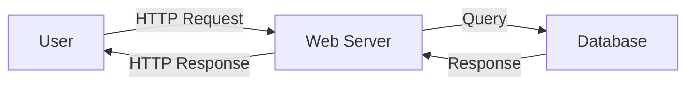
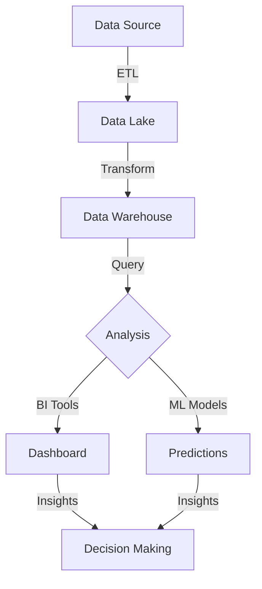
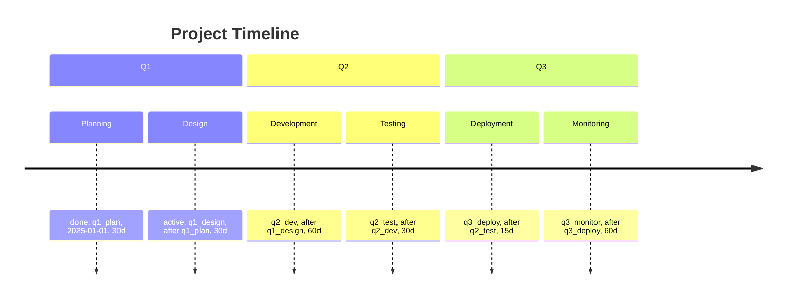
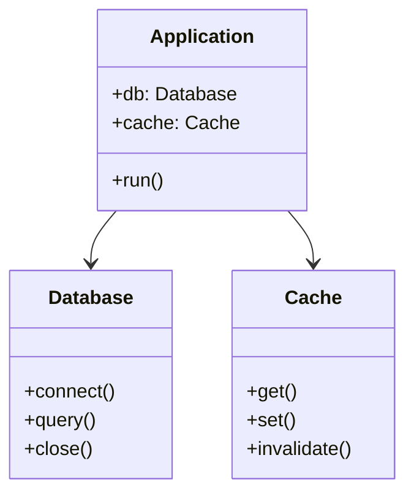

This page demonstrates the Mermaid diagram and Dracula syntax highlighting theme support.

## Simple Architecture Diagram



## Code Block with Dracula Theme

Here's a Python example with Dracula syntax highlighting:

```python
def fibonacci(n):
    """Calculate the nth Fibonacci number"""
    if n <= 1:
        return n
    return fibonacci(n - 1) + fibonacci(n - 2)

# Example usage
result = fibonacci(10)
print(f"The 10th Fibonacci number is: {result}")
```

## JavaScript Example

```javascript
async function fetchUserData(userId) {
  try {
    const response = await fetch(`/api/users/${userId}`);
    const data = await response.json();
    return data;
  } catch (error) {
    console.error("Error fetching user:", error);
    return null;
  }
}

// Usage
const user = await fetchUserData(123);
```

## TypeScript with React

```typescript
import React, { useState } from "react";

interface User {
  id: number;
  name: string;
  email: string;
}

export const UserCard: React.FC<{ user: User }> = ({ user }) => {
  const [expanded, setExpanded] = useState(false);

  return (
    <div className="user-card">
      <h2>{user.name}</h2>
      <p>{user.email}</p>
      <button onClick={() => setExpanded(!expanded)}>
        {expanded ? "Hide" : "Show"} Details
      </button>
    </div>
  );
};
```

## Complex Data Flow Diagram



## SQL Query Example

```sql
SELECT
  u.user_id,
  u.username,
  COUNT(o.order_id) as total_orders,
  SUM(o.total_amount) as total_spent
FROM users u
LEFT JOIN orders o ON u.user_id = o.user_id
WHERE u.created_at >= DATE_SUB(NOW(), INTERVAL 1 YEAR)
GROUP BY u.user_id, u.username
ORDER BY total_spent DESC
LIMIT 10;
```

## HTML Example

```html
<!DOCTYPE html>
<html lang="en">
  <head>
    <meta charset="UTF-8" />
    <meta name="viewport" content="width=device-width, initial-scale=1.0" />
    <title>Sample Page</title>
  </head>
  <body>
    <header>
      <h1>Welcome to Our Site</h1>
      <nav>
        <ul>
          <li><a href="/">Home</a></li>
          <li><a href="/about">About</a></li>
        </ul>
      </nav>
    </header>
  </body>
</html>
```

## Mermaid Timeline



## CSS Example

```css
:root {
  --primary-color: #282a36;
  --accent-color: #ff79c6;
  --success-color: #50fa7b;
}

.code-block {
  background-color: var(--primary-color);
  color: #f8f8f2;
  border-radius: 0.75rem;
  padding: 1.5rem;
  overflow-x: auto;
}

.code-block code {
  font-family: "Courier New", monospace;
  font-size: 0.875rem;
}
```

## Bash/Shell Script

```bash
#!/bin/bash

# Colors for output
RED='\033[0;31m'
GREEN='\033[0;32m'
YELLOW='\033[1;33m'
NC='\033[0m' # No Color

# Function to print colored output
print_status() {
  if [ $1 -eq 0 ]; then
    echo -e "${GREEN}✓ Success${NC}"
  else
    echo -e "${RED}✗ Failed${NC}"
  fi
}

# Main script
echo "Starting deployment..."
npm run build
print_status $?
```

## Mermaid Class Diagram



## JSON Configuration

```json
{
  "name": "my-app",
  "version": "1.0.0",
  "description": "Sample application",
  "dependencies": {
    "react": "^19.0.0",
    "next": "^15.0.0",
    "tailwindcss": "^4.0.0"
  },
  "devDependencies": {
    "typescript": "^5.8.0",
    "eslint": "^9.0.0"
  },
  "scripts": {
    "dev": "next dev",
    "build": "next build",
    "start": "next start"
  }
}
```

## Testing Section

Below you'll see code examples properly syntax-highlighted with the **Dracula theme**. Each code block should have:

- Dark background (#282a36)
- Light text (#f8f8f2)
- Syntax-highlighted keywords, strings, and comments
- Proper line spacing and padding
- Rounded corners and subtle shadow

The **Mermaid diagrams** should be rendered with proper formatting and styling, showing various diagram types like flowcharts, class diagrams, and timelines.

---

**Questions?** [Contact our team](/contact) to discuss your data and engineering needs.
