# Blog Rendering Fixes - Mermaid & LaTeX Support

**Date**: December 6, 2025  
**Task**: Fix mermaid rendering issues, ensure LaTeX/math formula support, and fix blank Figure 3 diagram

## Issues Identified

1. **Mermaid Rendering Messy**: Diagrams were rendering but visual quality and layout needed improvement
2. **LaTeX/Math Formula Support**: KaTeX stylesheet was failing to load (404 error from CDN), causing math formulas to not render properly
3. **Figure 3 Blank**: The Trajectory Comparison diagram (Cannon vs. Guided Missile) was not rendering properly due to subgraph syntax issues in LR (left-to-right) layout

## Changes Made

### 1. Fixed KaTeX Stylesheet Loading (src/app/blog/[slug]/page.tsx)

**Problem**: The KaTeX stylesheet was being loaded via an invalid `<link>` element inside JSX, which doesn't work in React.

**Solution**: Added a `beforeInteractive` Script that dynamically injects the KaTeX stylesheet into the document head:

```typescript
<Script
  id="katex-stylesheet"
  strategy="beforeInteractive"
  dangerouslySetInnerHTML={{
    __html: `
      // Inject KaTeX stylesheet if not already present
      if (!document.querySelector('link[href*="katex"]')) {
        const link = document.createElement('link');
        link.rel = 'stylesheet';
        link.href = 'https://cdn.jsdelivr.net/npm/katex@0.16.25/dist/katex.min.css';
        document.head.appendChild(link);
      }
    `,
  }}
/>
```

**Benefits**:

- KaTeX stylesheet now loads correctly before page renders
- Math formulas in Mermaid diagrams render properly (using `forceLegacyMathML` setting)
- LaTeX expressions like `$99\%$`, `$$0.99^{10} \approx 90.4\%$$` now display correctly

### 2. Fixed Figure 3 Mermaid Subgraph Rendering (content/blog/autonomy-heartbeat.mdx)

**Problem**: Figure 3 used `graph LR` (left-to-right) with subgraphs, which doesn't render well in Mermaid. The subgraph syntax had issues and the diagram appeared blank.

**Solution**: Refactored the diagram to use `graph TD` (top-to-bottom) with proper subgraph formatting:

```mermaid
graph TD
    subgraph Cannon["<b>Traditional Agent (Cannon)</b>"]
        C1["🎯 Goal"]
        C2["Step 1"]
        C3["Step 5<br/><small>small error</small>"]
        C4["Step 50<br/><small>false assumption</small>"]
        C5["Step 500<br/>💥 Catastrophic"]

        C1 --> C2
        C2 --> C3
        C3 -->|drift| C4
        C4 -->|drift| C5

        style C1 fill:#FFD700,stroke:#333,color:#000
        style C5 fill:#FF6347,stroke:#900,color:#fff
        style C3 fill:#FFA500,stroke:#333,color:#fff
        style C4 fill:#FF8C00,stroke:#333,color:#fff
    end

    subgraph Guided["<b>Stabilized Agent (Guided Missile)</b>"]
        G1["🎯 Goal"]
        G2["Step 1-10"]
        G3["🔍 Checkpoint"]
        G4["Step 11-20"]
        G5["🔍 Checkpoint"]
        G6["Step 21-30"]
        G7["🔍 Checkpoint"]
        G8["✅ Success"]

        G1 --> G2
        G2 --> G3
        G3 --> G4
        G4 --> G5
        G5 --> G6
        G6 --> G7
        G7 --> G8

        style G1 fill:#FFD700,stroke:#333,color:#000
        style G8 fill:#90EE90,stroke:#333,color:#000
        style G3 fill:#87CEEB,stroke:#333,color:#000
        style G5 fill:#87CEEB,stroke:#333,color:#000
        style G7 fill:#87CEEB,stroke:#333,color:#000
    end
```



**Key Changes**:

- Changed from `graph LR` to `graph TD` for better vertical layout of subgraphs
- Added proper HTML styling with `<b>` tags for bold text in subgraph labels
- Used `<br/><small>` for better text formatting in nodes
- Added proper stroke colors to make nodes more visually distinct
- Simplified line styling (removed dotted lines `-.drift.->` which don't render well, replaced with labeled arrows `-->|drift|`)

### 3. Improved Mermaid Initialization Configuration (src/app/blog/[slug]/page.tsx)

**Problem**: Mermaid diagrams had basic configuration that didn't optimize for visual quality and rendering.

**Solution**: Enhanced the Mermaid initialization script with:

```typescript
mermaid.initialize({
  startOnLoad: true,
  theme: "light",
  securityLevel: "loose", // Allow all HTML features
  forceLegacyMathML: true, // Enable LaTeX/KaTeX support
  flowchart: {
    useMaxWidth: true,
    padding: 20,
  },
  diagram: {
    useMaxWidth: true,
  },
  themeVariables: {
    primaryColor: "#ffffff",
    primaryBorderColor: "#333333",
    primaryTextColor: "#000000",
    primaryBorderWidth: "2px",
    background: "#ffffff",
    mainBkg: "#ffffff",
    mainBorder: "#333333",
    clusterBkg: "#f0f0f0",
    clusterBorder: "#999999",
    edgeLabelBackground: { fill: "#ffffff", color: "#000000" },
    fontSize: "14px",
    fontFamily: "system-ui, -apple-system, sans-serif",
  },
});
```

**Benefits**:

- Better visual rendering with darker borders and improved contrast
- Proper max-width handling for responsive diagrams
- Enhanced clustering/subgraph appearance
- Better edge label rendering with background
- System-default font for better compatibility

## Files Modified

1. **src/app/blog/[slug]/page.tsx**

   - Removed invalid `<link>` element
   - Added KaTeX stylesheet injection script
   - Enhanced Mermaid initialization configuration

2. **content/blog/autonomy-heartbeat.mdx**
   - Refactored Figure 3 from `graph LR` with subgraphs to `graph TD`
   - Improved node formatting with HTML and emojis
   - Better visual styling with stroke colors

## Testing & Validation

✅ **Build Process**: Project built successfully without errors  
✅ **KaTeX Loading**: Stylesheet now injected correctly  
✅ **Math Formulas**: LaTeX expressions render properly in text  
✅ **Mermaid Diagrams**: All 4 diagrams (Figure 1, 2, 3, 4) render correctly  
✅ **Figure 3 Rendering**: Now displays properly as vertical subgraph layout  
✅ **Visual Quality**: Improved contrast and styling makes diagrams clearer  
✅ **No Regressions**: All other blog features remain functional

## Browser Compatibility

- ✅ Tested in Chrome/Edge-based browsers
- ✅ KaTeX stylesheet loads from CDN (cdn.jsdelivr.net)
- ✅ Mermaid library loads from CDN (cdn.jsdelivr.net)
- ✅ Math formulas display using legacy MathML approach for broad compatibility

## Performance Impact

- **Minimal**: KaTeX stylesheet is cached by browser CDN
- **No JS bloat**: Scripts load asynchronously (lazyOnload strategy)
- **Responsive**: Mermaid diagrams use responsive sizing

## Next Steps (Optional Enhancements)

1. **Local KaTeX Hosting**: Host KaTeX stylesheet locally instead of CDN for offline support
2. **SRI Integrity**: Add Subresource Integrity (SRI) hashes to CDN resources for security
3. **Advanced Mermaid**: Consider additional diagram types (ER diagrams, gitGraph, etc.)
4. **Math in Diagrams**: Test complex mathematical expressions within Mermaid nodes

## Notes

- The `forceLegacyMathML: true` setting ensures KaTeX is used for math rendering across all browsers
- Math formulas use standard LaTeX syntax: `$inline$` for inline math, `$$block$$` for display math
- Subgraph rendering improved significantly with `graph TD` vs. the problematic `graph LR` approach
